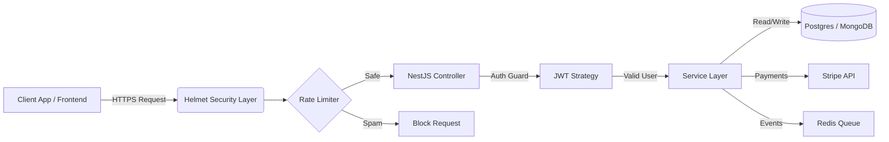

# Production-Ready Backend Architecture for FinTech & SaaS

A battle-tested NestJS boilerplate designed for speed, security, and scalability. Unlike standard templates, this engine comes pre-configured with the "Day 1" essentials required for high-compliance financial and data applications.

[](https://github.com/omerhabib62/mercenary-api-starter/actions/workflows/production-ci.yml)

---

## ⚡️ Core Capabilities

- **🛡 Production Security:** Hardened with **Helmet** headers, strict **CORS** policies, and global **Rate Limiting** (Throttling) to prevent DDoS.
- **🔐 Scalable Auth:** JWT-based authentication system with Role-Based Access Control (RBAC) guards.
- **💳 Payment Ready:** Integrated **Stripe** module supporting Checkouts, Webhooks, and Subscription lifecycles.
- **⚡️ Event-Driven:** Built-in **Redis** configuration for handling async background jobs and queues.
- **🐳 Containerized:** Fully Dockerized environment (App + Postgres) with automated Health Checks.
- **📝 Auto-Documentation:** Live **Swagger/OpenAPI** specs generated automatically at `/api/docs`.

---

## 🚀 Quick Start

Get the system running in under **2 minutes**.

### Prerequisites

- **Docker & Docker Compose**
- **Node.js 16+**

### Installation

**1. Clone the repository:**

```bash
# 1. Clone
git clone [https://github.com/omerhabib62/mercenary-api-starter.git](https://github.com/omerhabib62/mercenary-api-starter.git)
```

**2. Install Dependencies:**

``` bash
npm install
```
**3. Launch Infrastructure (Docker):**
``` bash
docker-compose up -d
#or
docker-compose up
```

***Starts Postgres DB on port 5435 to avoid local conflicts.***
**4. Run Application:**
``` bash
npm run start:dev
```

------------------------------------------------------------------------

## 🛠 Technical Specifications

### Global Interceptors
The API enforces a strict response structure to ensure consistent client-side parsing:
```bash
// Success Response
{
  "data": { ... },
  "timestamp": "2023-10-25T10:00:00Z"
}
```
### Exception Handling

No more leaking stack traces to production. The **Global Exception Filter** catches all errors and returns sanitized, user-friendly JSON messages.

### Health Checks

Includes a dedicated ```/health``` endpoint for **AWS/Kubernetes load balancers** to monitor database connectivity and service uptime.

------------------------------------------------------------------------

## ⚙️ Environment Configuration
Copy ```.env.example``` to ```.env``` and configure your keys.

### **Default Docker Config:**

Use port **5435** to avoid conflict with any local Postgres installed on your machine.

``` env
PORT=3000
NODE_ENV=development

# Database (Docker)
DB_HOST=localhost
DB_PORT=5435
DB_USERNAME=admin
DB_PASSWORD=password123
DB_NAME=mercenary_api

PORT=3000
NODE_ENV=development

# Database (Docker)
DB_HOST=localhost
DB_PORT=5435
DB_USERNAME=admin
DB_PASSWORD=password123
DB_NAME=mercenary_api

# Stripe
STRIPE_SECRET_KEY=sk_test_...
```

------------------------------------------------------------------------

### **Using Local System Postgres**

If you prefer local installation, use port **5432** and your local credentials.

``` env
# Database (Local)
DB_HOST=localhost
DB_PORT=5432
DB_USERNAME=postgres
DB_PASSWORD=yourpassword
DB_NAME=mercenary_api
```

------------------------------------------------------------------------

## Docker Compose Configuration

``` yaml
version: '3.8'

services:
  postgres:
    image: postgres:15-alpine
    container_name: mercenary_db
    ports:
      - '5435:5432'
    environment:
      POSTGRES_USER: admin
      POSTGRES_PASSWORD: password123
      POSTGRES_DB: mercenary_api
    volumes:
      - postgres_data:/var/lib/postgresql/data
    healthcheck:
      test: ["CMD-SHELL", "pg_isready -U admin -d mercenary_api"]
      interval: 10s
      timeout: 5s
      retries: 5
    restart: always

volumes:
  postgres_data:
```
------------------------------------------------------------------------

## 📚 API Documentation


Once running, visit ```http://localhost:3000/api/docs``` to view the interactive Swagger UI.

## 🛡 System Architecture


